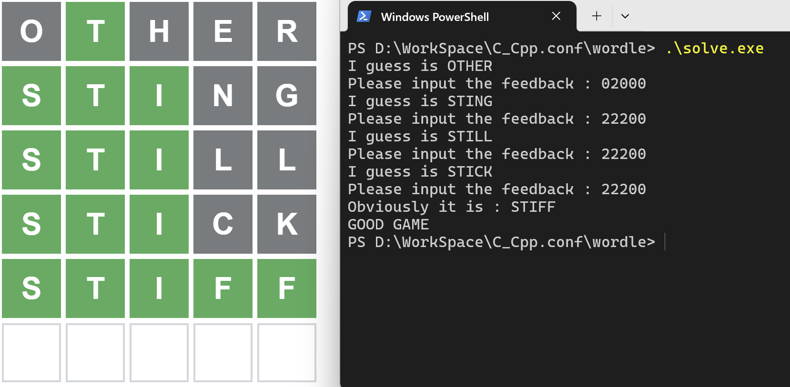
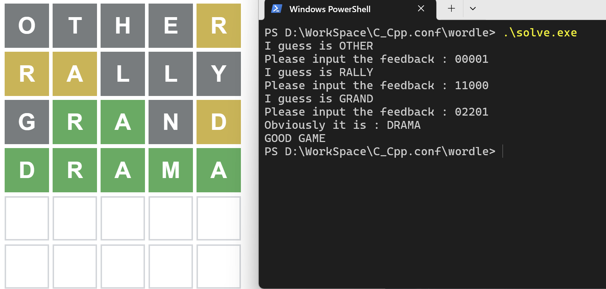

# 可以解决wordle的程序

娱乐用。

直接使用常见的编译器如gcc等即可完成编译，请把可执行程序和english_quadgrams.txt、word_list.txt放在同一个目录下运行，程序要读这两个文件的数据。

第一个猜测的词是OTHER，这样可以提供尽可能多的有效信息，虽然我无法证明，但是这应该可以帮助我将猜测的次数降低到最少。

# wordle_solver
A program that can solve wordle game

Directly compile the solve.cpp using gcc or whatever compiler you prefer.

Run with file english_quadgrams.txt and word_list.txt under the same directory.

Examples：

